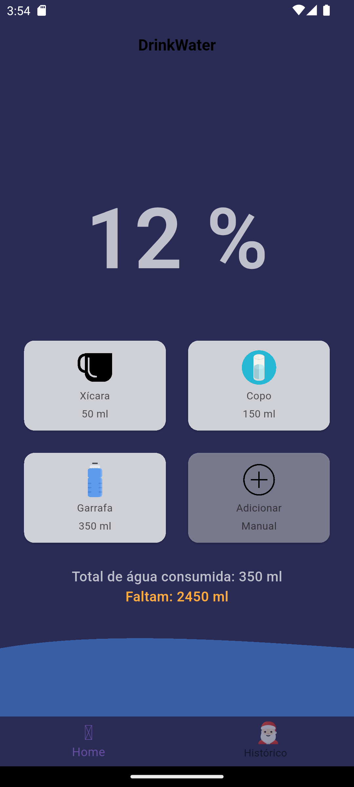
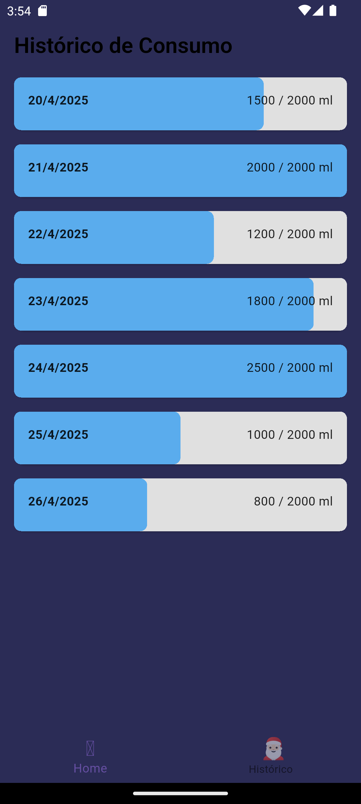

# 💧 Drink Water App

O **Drink Water** é um aplicativo desenvolvido em **Flutter** que incentiva o usuário a consumir a quantidade ideal de água diariamente.  
O app oferece uma visualização gráfica animada do progresso e permite registrar a ingestão de água com toques rápidos.

## ✨ Funcionalidades
- Visualização do progresso com animação de ondas (simulando o nível da água).
- Registro rápido de consumo com itens pré-definidos ou entrada manual.
- Histórico de consumo diário (em breve!).
- Design limpo e intuitivo.

---

## 🛠 Instalação e Configuração

Siga os passos abaixo para rodar o projeto localmente:

1. **Clone o repositório:**
   ```bash
   git clone https://github.com/seu-usuario/drink_water_app.git
   ```

2. **Navegue até o diretório do projeto:**
   ```bash
   cd drink_water_app
   ```

3. **Instale as dependências:**
   ```bash
   flutter pub get
   ```

4. **Execute o aplicativo:**
   ```bash
   flutter run
   ```

> **Nota:**  
> Certifique-se de ter o Flutter instalado e configurado corretamente no seu sistema.  
> Veja o guia oficial [aqui](https://docs.flutter.dev/get-started/install).

---

## 📂 Estrutura de Pastas

```
lib/
├── models/
│   └── itens_model.dart
├── providers/
│   └── consumo_provider.dart
├── telas/
│   ├── home.dart
│   ├── historico.dart
│   └── navBar.dart
├── main.dart
assets/
└── icons/
    └── (ícones SVG utilizados no app)
```

---

## 📸 Screenshots

| Home Page | Adicionar Água |
|:---------:|:--------------:|
|  |  |

---

## 🚀 Tecnologias Utilizadas

- [Flutter](https://flutter.dev/)
- [Provider](https://pub.dev/packages/provider) (gerenciamento de estado)
- [Sensors Plus](https://pub.dev/packages/sensors_plus) (acelerômetro para movimentação da água)
- [Flutter SVG](https://pub.dev/packages/flutter_svg) (ícones em SVG)

---

## 📋 TODOs futuros

- Implementar histórico completo de consumo por dia.
- Notificações para lembrar de beber água.
- Personalização da meta de consumo diário.

---

## 👨‍💻 Autor

- (https://github.com/raphapinho)

---
